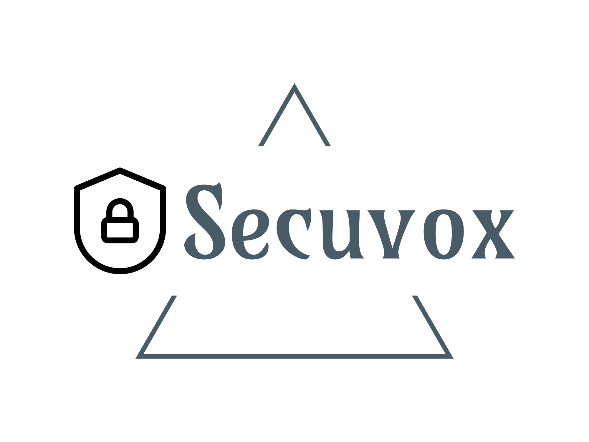

</img>  
<b>Secuvox Browser is a webbrower on steroids!</b> 
============================================= 
Secuvox blocks functions which ad networks do use to track your surfing behaviour and to create profiles of your person. 
Did you ever wonder why those ads do know your preferences? You scroll to an article in the news, read it - and bam, you get contextual ads. 
They can't read your mind, if you're worried about that. All they do is to monitor your scrolling- and mouse movement behaviour. 
 
This is where Secuvox comes into play. It keeps ad networks from being able to programatically track your surfing behaviour. 
You can select what kinds of information to block per page: Mouse movement, scrolling, or generic events. 
 
In adition, Secuvox pretends to be the Google bot. Thus, many cookie banners and tracking function will vanish. 
It does also send "Do not track" headers and block ads as well as most cookie banners. 
Referer data (that's information about what webpage has led you to another webpage) is also being blocked. 
 
Sevuvox does have two kinds of adblockers implemented: UblockOrigin as well as a host based filter list to provide even more privacy! 
 
All this comes with a small cost, as allways in life: 
First of all, some webpages may be display badly. That's due to the nature of webdesign, and which techniques ad companies do use. 
To solve this, you can select specifically which tracking features you want to block per webpage. 
Second of all, second media can't be blocked. That's due to the nature of it being relying on endless scrolling. As soon as a page relies on endless scrolling, it is dependant of monitoring scroll behaviour. 
Thus, the blocking features are disabled for most social media pages. 
 
<b>FAQ:</b> 
============================================= 
<b>What tracking problems does Secuvox solve?</b> 
-Mouse tracking 
-Scroll behaviour 
-Generic events (events that are created procedurally) 
-Referers 
-Third party cookies 
-Display of ads 
-Cookie banners 
-Secuvox does allways send the "Do not track" header 
 
<b>So it is bulletproof? Am I 100% protected from being tracked by all means?</b> 
Short answer: No. 
Long answer: It would be impossible. 
 
<b>What engine do you use?</b> 
Microsoft Edge 
 
<b>Why Microsoft Edge?</b> 
The engine does get updated by Windows update. Thus, Secuvox will not be obsolete in a long period of time, even if I do stop developing it. 
 
<b>Most common errors:</b> 
============================================= 
("Settings" referes to the gear icon right of the URL field) 
Please note that disabling any of the features may break the privacy protection. 
 
<b>Pictures are not being displayed:</b> 
Disable Settings->Block Scroll->CSS Scroll Block 
 
<b>A webpage blocks me completely from displaying it:</b> 
Disable Settins->Fake Google Bot 
If the page does still block you, you will most likely have to clear browsing data after disabling Google Bot and reload the page. 
 
<b>A webpage does not open due to an adblocker having been installed:</b> 
Disable Settings->Extra Adblocker 
 
<b>A webpages seems to be cut at the end, not allowing me to scroll further:</b> 
Disable Settings->Block Scroll 
 
<b>Hovering over the menu items of a webpage does not open the submenu:</b> 
Disable Settings->Block Hover 
 

<b>Credits:</b> 
============================================= 
<b>Addons implemented by Secuvox:</b> 
Ublock Origin by ... 
Cookie Ninja by ... 
 
<b>Icons used:</b> 
Ui Icons created by FACH - Flaticon 
Refresh icons created by Freepik - Flaticon</a> 
Settings icons created by Md Tanvirul Haque - Flaticon 
Question icons created by Freepik - Flaticon 
Play icons created by Freepik - Flaticon 
Arrow icons created by Freepik - Flaticon 
https://www.flaticon.com/ 
 
<b>Hosts based filter list by Steven Black:</b> 
https://github.com/StevenBlack/hosts 
